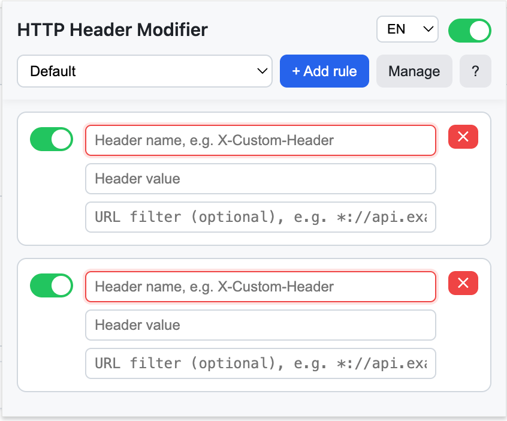
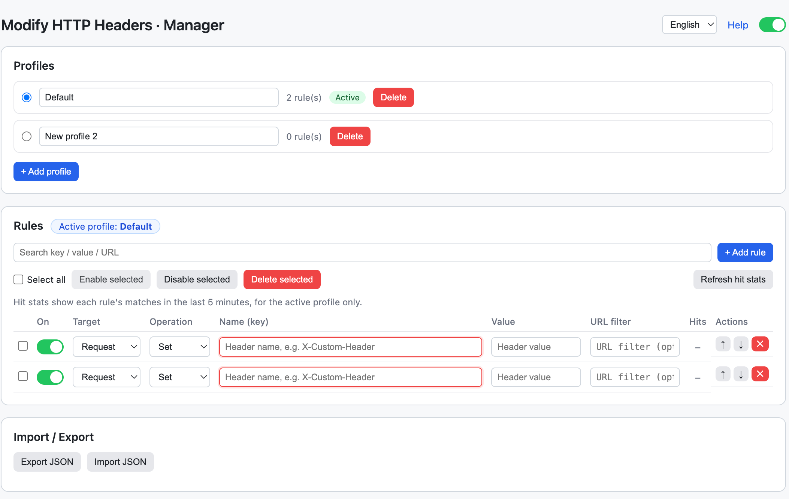
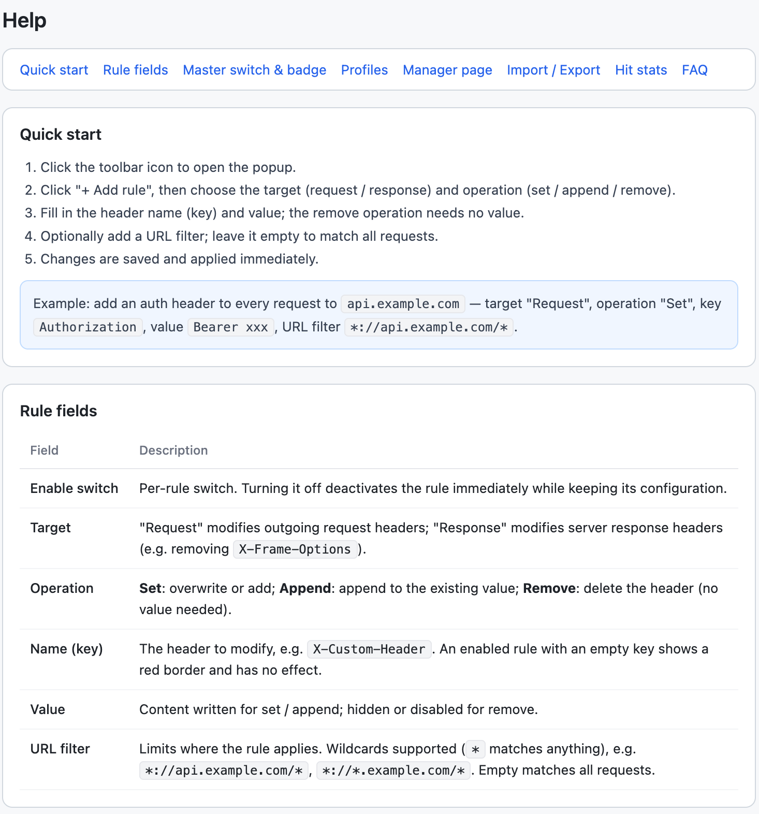

# Modify HTTP Headers

English | [简体中文](docs/README_zh.md)

A browser extension for setting HTTP request headers, supporting **Chrome** and **Firefox** (Manifest V3).

## Screenshots







## Features

- Set HTTP **request headers** using key-value pairs (overwrite if present, add if absent)
- Each rule supports URL matching (with wildcards like `*://api.example.com/*`); leave empty to apply to all requests
- Toggle switch for each rule; **global master switch** to pause all rules at once
- Toolbar icon badge shows status: number = active rules count, `OFF` = master switch disabled, `ERR` = rule sync failed (error details shown in popup)
- **Multiple Profiles**: Store different rule sets like "Development" and "Testing", switch with one click
- **Full management page**: Search rules, reorder (move up/down), batch enable/disable/delete
- **Import / Export**: JSON format for easy team sharing and migration
- **Bilingual interface**: Initial language detected from browser (Chinese for Mainland China/Hong Kong/Macau/Taiwan, English otherwise); manually switchable in popup or management page (applies to popup/management/help pages)
- **Built-in help docs**: Click `?` in popup or "Help" in management page for module-based explanations and FAQs
- Rules enabled without header name will show a red border warning

Built on `declarativeNetRequest` dynamic rules; URL matching uses DNR's [`urlFilter` syntax](https://developer.mozilla.org/en-US/docs/Mozilla/Add-ons/WebExtensions/API/declarativeNetRequest#filter_pattern_syntax).

## Build

Build separately for each browser (root `manifest.json` is Chrome format, Firefox-specific fields injected during build):

```bash
npm run build           # Build both chrome and firefox
npm run build:chrome    # Chrome only
npm run build:firefox   # Firefox only
```

Output in `dist/`:

- `dist/chrome/`, `dist/firefox/`: Unpacked directories ready to load in browser
- `chrome-v*.zip`, `firefox-v*.zip`: Distribution packages

## Installation

### Chrome / Edge

1. Open `chrome://extensions` (Edge: `edge://extensions`)
2. Enable "Developer mode"
3. Click "Load unpacked" and select the **project root directory** (or `dist/chrome/`)

### Firefox (128+)

Firefox's MV3 background script format differs from Chrome (`background.scripts`), requires build first:

1. Run `npm run build:firefox`
2. Open `about:debugging#/runtime/this-firefox`
3. Click "Load Temporary Add-on" and select `dist/firefox/manifest.json`

> Temporarily loaded add-ons disappear after restart and need to be reloaded; official distribution requires packaging as `.xpi` and signing.

## Usage

1. Click toolbar icon to open popup
2. Click "+ Add Rule"
3. Enter the request header name (key) and value
4. Optionally enter URL match pattern (e.g., `*://api.example.com/*`); leave empty to apply to all requests
5. Use toggle to enable/disable, click `✕` to delete; master switch in top-right pauses all rules
6. Use dropdown at top to switch profiles; click "Manage" to open full management page (profile management, search, batch operations, import/export)

Changes are saved and applied immediately.

## Notes

- Some browser-protected headers may not be modifiable.
- To confirm a rule took effect, check the request's Headers in the DevTools Network panel.
- Firefox requires version 128 or higher.
